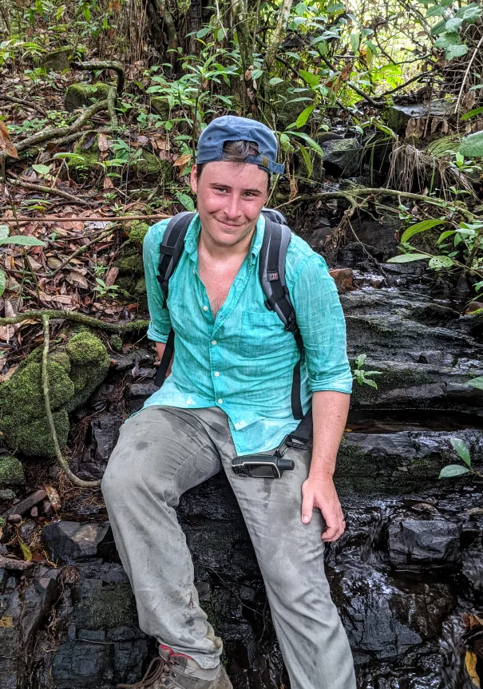

::: {.about-header}

{.about-photo fig-alt="David Simons sitting on a rock in forest during fieldwork, with a backpack and a GPS unit."}

::: {.about-intro}
[]{.about-role}

[, ]()

Epidemiologist and infectious disease ecologist. I study how people reshape the landscapes they live in, how small mammals respond, and what that means for the viruses they carry, mostly Lassa fever in West Africa.

::: {.about-links}
[ ORCID](https://orcid.org/)
[ Scholar](https://scholar.google.com/citations?user=)
[ GitHub](https://github.com/)
[<i class="bi bi-bluesky"></i> Bluesky](https://bsky.app/profile/)
[ LinkedIn](https://www.linkedin.com/in/)
[ OSF](https://osf.io/rk8at/)
[ Email](mailto:)
[ CV](cv.pdf)
:::
:::

:::

## Now

As a [Birgitta Sintring Fellow](research/bank-voles.qmd) at Uppsala University, I am developing microbial sensors that measure indirect contact among bank voles, to understand how rodent-borne viruses move through host populations. I also lead a Vetenskapsrådet South Korea–Sweden project on [directing rodent sampling](research/surveillance.qmd), and I am a Fellow-in-Residence with the [Verena Consortium](https://www.viralemergence.org/), where I co-lead [Project ArHa](research/arha.qmd) with Stephanie Seifert.

I am also a postdoctoral scholar in Sagan Friant's RISK lab at Pennsylvania State University, working on the [SCAPES](research/scapes.qmd) project in Nigeria, and I am on the external expert list of the European Centre for Disease Prevention and Control. My PhD, completed in 2024, studied Lassa fever host ecology in [Sierra Leone](research/sierra-leone.qmd), across the Royal Veterinary College, University College London and the London School of Hygiene and Tropical Medicine, funded by a BBSRC studentship through the LIDo doctoral training partnership.

I trained in medicine first. I worked as a doctor at the Hospital for Tropical Diseases through the COVID-19 pandemic, and as an analyst in the UK Health Security Agency's outbreak surveillance team during the emergence of Omicron and the 2022 mpox outbreak. I am out of clinical practice while I learn Swedish to transfer my medical registration. I live in Stockholm.

## Appointments

::: {.cv-timeline}
- [2026–]{.cv-when} [**Birgitta Sintring Fellow**, Department of Ecology and Genetics, Uppsala University]{.cv-what}
- [2025–]{.cv-when} [**External Expert**, European Centre for Disease Prevention and Control]{.cv-what}
- [2023–]{.cv-when} [**Postdoctoral Scholar**, Department of Anthropology and Center for Infectious Disease Dynamics, Pennsylvania State University]{.cv-what}
- [2023–]{.cv-when} [**Fellow-in-Residence**, Verena Consortium]{.cv-what}
- [2021–2022]{.cv-when} [**Senior Analyst**, Outbreak Surveillance Team, UK Health Security Agency]{.cv-what}
- [2020]{.cv-when} [**Visiting Researcher**, EcoHealth Alliance, New York]{.cv-what}
- [2019–2022]{.cv-when} [**Resident Doctor**, Hospital for Tropical Diseases, University College London Hospitals]{.cv-what}
:::

## Education

::: {.cv-timeline}
- [2024]{.cv-when} [**PhD**, Epidemiology of Emerging Zoonotic Infectious Diseases, University of London (RVC, UCL and LSHTM)]{.cv-what}
- [2019]{.cv-when} [**MSc**, Tropical Medicine and International Health, London School of Hygiene and Tropical Medicine]{.cv-what}
- [2018]{.cv-when} [**DTM&H**, Diploma in Tropical Medicine and Hygiene, London School of Hygiene and Tropical Medicine]{.cv-what}
- [2016]{.cv-when} [**MBBS**, Medicine and Surgery, King's College London]{.cv-what}
- [2011]{.cv-when} [**MSc**, Biodiversity and Conservation, University of Leeds]{.cv-what}
- [2010]{.cv-when} [**BSc**, Natural Sciences, University of Leeds]{.cv-what}
:::

## Open science

Study protocols go on the [Open Science Framework](https://osf.io/rk8at/) before the analysis, code is on [GitHub](https://github.com/), and data are released openly where the ethics allow, for example through [PHAROS](https://pharos.viralemergence.org/) and Zenodo; the deposits are listed on the [tools page](research/tools.qmd#data-deposits). The full record is in my [CV](cv.pdf).
