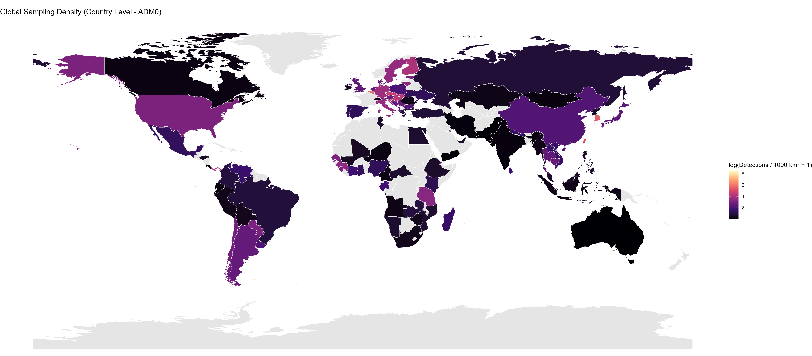
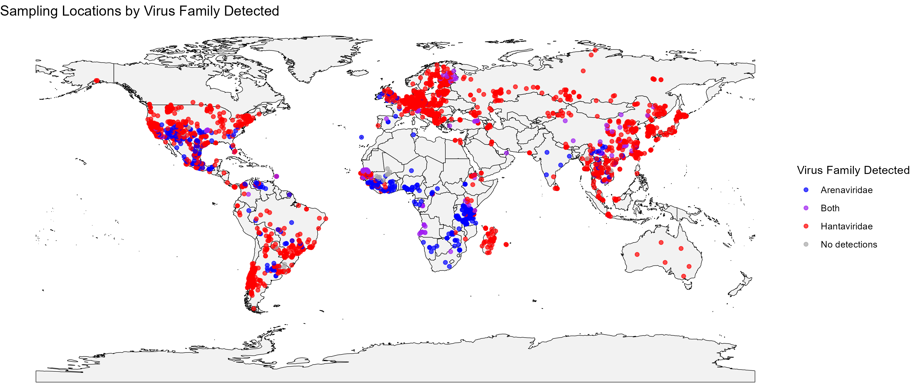

Project ArHa is a collaborative effort to synthesize published sampling records of arenaviruses and hantaviruses in small-mammal populations across the globe. This work is led by myself and Dr. [Stephanie Seifert](https://vetmed.wsu.edu/profile/seifert-stephanie/) and is supported by the Fellows-in-Residence programme of the [Verena consortium](https://www.viralemergence.org/).

## Project Aims
1.  To produce a comprehensive, spatially and temporally explicit database of arenavirus and hantavirus surveillance in small mammals.
2.  To develop open-source tools for visualizing and exploring the data, allowing researchers to identify geographic and taxonomic sampling gaps.
3.  To use the synthesized data to investigate the ecological, geographic, and genomic factors that facilitate cross-species transmission and viral evolution.

---

## Key Outputs

#### 1. The Published Protocol
The methodology, including our literature search strategy, data extraction criteria, and database structure, has been published in *Wellcome Open Research*.

* **Full Citation:** Simons, D., Seifert, S., et al. (2025). "Project ArHa: A protocol for a global database of arenaviruses and hantaviruses in small-mammal hosts". *Wellcome Open Research*, 10(227).
* **DOI:** [**10.12688/wellcomeopenres.22119.1**](https://wellcomeopenresearch.org/articles/10-227)

> ##### Abstract
> Arenaviruses and Hantaviruses, primarily hosted by rodents and shrews, represent significant public health threats due to their potential for zoonotic spillover into human populations. Despite their global distribution, the full impact of these viruses on human health remains poorly understood, particularly in regions like Africa, where data is sparse. Both virus families continue to emerge, with pathogen evolution and spillover driven by anthropogenic factors such as land use change, climate change, and biodiversity loss. Recent research highlights the complex interactions between ecological dynamics, host species, and environmental factors in shaping the risk of pathogen transmission and spillover. This underscores the need for integrated ecological and genomic approaches to better understand these zoonotic diseases. A comprehensive, spatially, and temporally explicit dataset, incorporating host-pathogen dynamics and human disease data, is crucial for improving risk assessments, enhancing disease surveillance, and guiding public health interventions. Such a dataset (ArHa) would also support predictive modelling efforts aimed at mitigating future spillover events. This paper proposes the development of this unified database for small-mammal hosts of Arenaviruses and Hantaviruses, identifying gaps in current research and promoting a more comprehensive understanding of pathogen prevalence, spillover risk, and viral evolution.

#### 2. The ArHa Database
The core output is the database itself. It is structured into five relational tables containing cleaned and standardized data on citations, study design, host occurrences, pathogen assays, and genetic sequences. The full data dictionary and technical details are available in our GitHub repository.

* **View the technical details on [GitHub](https://github.com/DidDrog11/arenavirus_hantavirus)**.

#### 3. The Interactive Data-Exploration App
To make the database accessible, we developed an R Shiny web application. It allows users to interactively filter, visualize, and explore the data without needing to write any code.

* **Explore the data using the [Project ArHa Shiny App](https://diddrog11.shinyapps.io/arenavirus_hantavirus_app/)**.
---

## Initial Insights from the Data

The database is nearing completion of its first phase of data extraction. The figures below provide a high-level summary of the taxonomic and geographic scope of the data collected so far, highlighting key trends and sampling gaps.

---

## Project Status Presentation
I delivered the presentation below to collaborators to summarise the current state of the database and the data processing pipeline.

