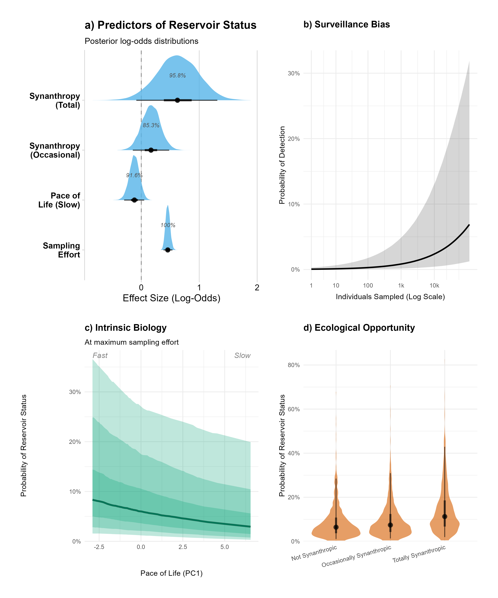

**[Read the full preprint on bioRxiv ](https://doi.org/10.64898/2026.06.03.729761)**

---

## Abstract

Small mammals, particularly rodents and shrews, act as primary reservoirs for Arenaviruses and Hantaviruses, zoonotic pathogens causing substantial global morbidity. However, our understanding of reservoir ecology is obscured by biased surveillance efforts, where sampling preferentially targets synanthropic species and high-income regions. It remains unclear whether observed patterns of reservoir competence, such as the association with synanthropy, are biological realities or artefacts of surveillance bias. We conducted a systematic review and data synthesis of global surveillance efforts (1960–2023), creating a harmonised database of over 590,000 recorded small mammals contributing 716,000 assay results. We then integrated this with macroecological trait data and phylogenetics to model reservoir probability using Bayesian phylogenetic dyadic generalised linear mixed models. 

We identified substantial taxonomic and geographic biases; surveillance is heavily skewed towards the Palearctic and widespread, large-bodied species, while 46% of host genera remain entirely unsampled. Geographically, surveillance intensity correlates strongly with accessibility and night-light intensity rather than host biodiversity. After statistically correcting for historical sampling volume, we demonstrate that reservoir status is a predictable biological trait. A fast pace of life (e.g., early maturity, large litters) is associated with an increased probability of reservoir status, independent of sampling effort. Synanthropy also remains a strong, independent predictor, indicating that commensal species act as genuine biological amplifiers in modified landscapes. Evolutionary analyses reveal a mosaic of broad lineage-level co-divergence punctuated by frequent, reactive host-switching. By projecting these models globally, we demonstrate that anthropogenic disturbance acts as an ecological filter, fundamentally challenging the assumption that pristine tropical ecosystems represent the highest intrinsic hazard for viral emergence.

---

## Key Findings

* **The Anthropogenic Filter:** Global surveillance is heavily driven by logistics and wealth rather than biodiversity. After 50 years of research, 46% of all rodent and shrew genera remain entirely unsampled.
* **Pace of Life Drives Competence:** After correcting for these extreme biases, we found that a "fast" life history (early maturity, large litters, small body mass) strongly and independently predicts viral reservoir status.
* **Synanthropy as a Risk Factor:** Obligate commensal species are genuine biological amplifiers. Totally synanthropic species exhibit an approximate 1.8-fold increase in the odds of reservoir competence compared to non-synanthropic species.
* **Re-evaluating Global Hazard:** By mapping intrinsic biological hazard rather than reactive spillover risk, we show that human land-use change acts as an ecological filter. Species-poor, disturbed landscapes often harbour communities with higher intrinsic reservoir potential than pristine, highly biodiverse tropical rainforests.

---

## Visualising the Risk

