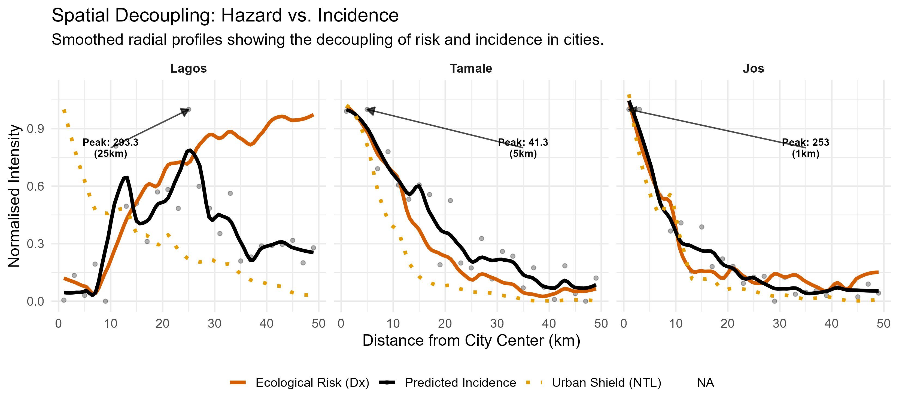
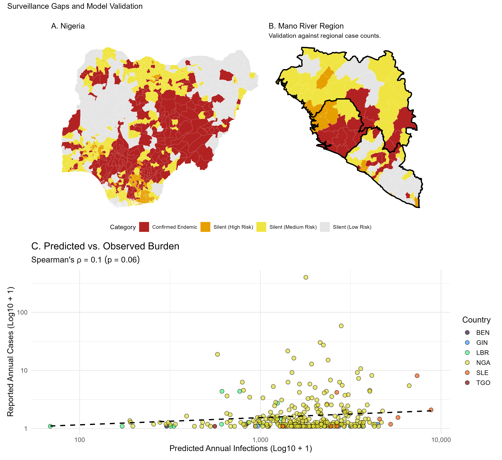

**[Read the preprint ](https://doi.org/10.64898/2025.12.17.25342147)**
*Accepted for publication in Epidemiology & Infection.*

---

## Background

Spatial risk models for Lassa fever generally predict that the primary reservoir, *Mastomys natalensis*, is restricted to rural landscapes, relying heavily on abiotic climatic envelopes. However, the rapid expansion of West African cities fundamentally alters local rodent dynamics through anthropogenic land-use shifts and novel multi-species competition. 

This study reconstructs the reservoir’s realised niche by implementing an Integrated Multi-Species Occupancy Model (IMSOM). This framework explicitly quantifies co-occurrence dynamics between *M. natalensis* and invasive commensals (*Rattus rattus*, *Mus musculus*) to correct the "urban blind spot" present in previous forecasting efforts. Furthermore, it introduces a "socio-economic shield"—proxied by nighttime lights—to model the non-linear dampening effect of urban infrastructure on zoonotic spillover. 

## Key Findings

By integrating multi-species biotic interactions and anthropogenic land-use into a high-resolution framework, the model demonstrates that Lassa fever possesses the biological potential to become a peri-urban disease.

* **Cryptic Urban Reservoir Niche:** Accounting for species interactions reveals that *M. natalensis* exhibits high ecological tolerance for peri-urban and human-modified landscapes, actively persisting alongside invasive competitors rather than facing strict competitive exclusion.
* **The Socio-economic Shield:** Urban infrastructure acts as a physical barrier, decoupling biological hazard from realised human spillover. While the biological hazard remains high in the peri-urban fringes, dense urban cores remain shielded from intense transmission.
* **Revised Infection Burden:** Adjusting for empirically modelled antibody waning (seroreversion) and spatial urban shielding yields an estimated regional burden of 2.6 million annual Lassa virus infections.
* **Identification of Silent Districts:** Spatial validation against clinical data identifies highly suitable "silent districts" in Nigeria, Benin, and Togo. These top-quartile incidence areas report zero cases, exposing profound surveillance gaps actively produced by structural inequalities rather than an absence of biological hazard.

## Visualising the Risk Dynamics

