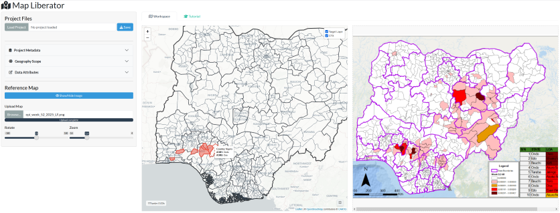
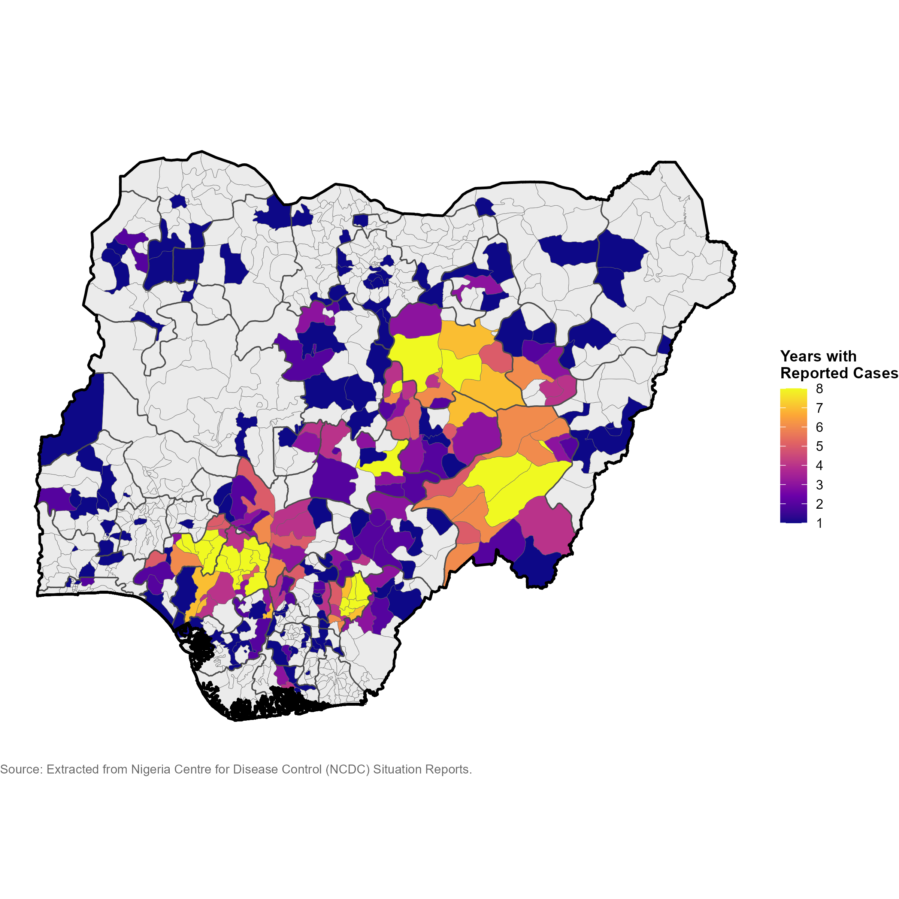

**[Access the codebase on GitHub ](https://github.com/DidDrog11/map-liberator)** | **[Read the preprint on medRxiv ](https://doi.org/10.1101/2026.01.26.26344575)**

---

## The Challenge: Locked Spatial Data

Effective epidemiological modelling requires highly granular spatial data. However, critical sub-national surveillance data is frequently aggregated and published solely as static choropleth or dot-density maps within PDF situation reports. 

Recovering this data for computational analysis creates a methodological bottleneck:
* **Proprietary GIS software** operates in closed ecosystems.
* **Open-source GIS** (e.g., QGIS) has a steep learning curve for field epidemiologists.
* **Manual transcription** is laborious, unscalable, and prone to typographic errors and gazetteer mismatches.

## The Solution: Map Liberator

To bridge the gap between static reports and spatial analysis, I developed **Map Liberator**, an open-source web application built in R and Shiny. 

Designed to be location- and disease-agnostic, Map Liberator provides a streamlined, split-screen interface. It allows users to overlay static reference maps alongside interactive official administrative boundaries (via GADM). Users can rapidly click to assign binary, numeric, or qualitative metadata to standard geometries, instantly generating structured, machine-readable datasets.

### Key Features
* **Split-Screen Digitisation:** Upload a static map (PNG/JPG), rotate and zoom to align with the interactive canvas, and extract data side-by-side.
* **Stateful Spatial Engine:** Handles complex, high-resolution national geometries (up to Admin Level 3) without browser latency by separating map initialization from polygon rendering.
* **Batch Processing:** Select multiple administrative units sharing a common attribute (e.g., disease presence) and commit them to the ledger simultaneously.
* **Semantic Output:** Extracted data is not a raster overlay; it is immediately joined to official administrative names and unique identifiers (GIDs), ready for immediate epidemiological modelling.

## Validation Case Study: Lassa Fever in Nigeria

To demonstrate the tool's utility, I extracted eight years of Lassa fever case notifications (2018–2025) from weekly Nigeria Centre for Disease Control (NCDC) Situation Reports. 

By mapping the static LGA attack rates against Nigeria's 774 Admin 2 boundaries, the digitisation process averaged **less than five minutes per map image**, eliminating transcription errors and generating a longitudinal dataset required to validate high-resolution spatial models.

## Future Directions

Map Liberator is currently in active development. Planned expansions include:
1. **Custom Geographies:** Support for user-uploaded shapefiles (`.shp` or `.gpkg`) for non-standard administrative zones.
2. **Computer Vision (CV) Integration:** Exploring `opencv` integration to automatically suggest polygon selections based on colour matching.
3. **DHIS2 Interoperability:** Direct export to standard exchange formats for seamless integration into national health information systems.