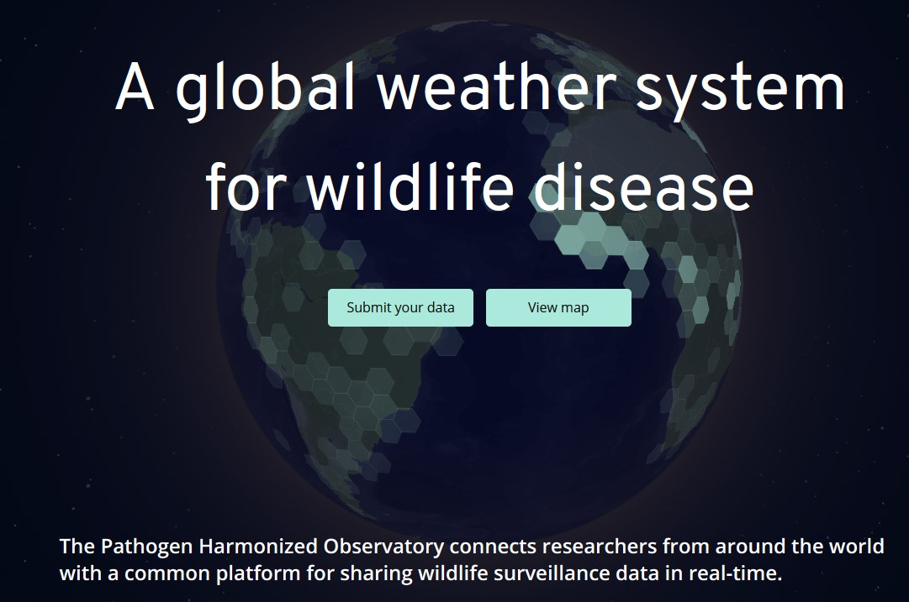

Rapid and transparent data sharing is critical for responding to threats from wildlife diseases. However, the value of shared data is often limited by a lack of standardization, with many datasets—especially those with negative results—being difficult to reuse.

To address this challenge, the [Verena Consortium](https://www.viralemergence.org/) developed a minimum data standard to ensure that wildlife disease studies are shared in a way that is FAIR (Findable, Accessible, Interoperable, and Reusable). This work supports the consortium's open-access database, [The Pathogen Harmonised Observatory (PHAROS)](https://pharos.viralemergence.org/about/). As a contributor to this effort, I helped develop and apply this standard.

## The Proposed Standard

Our checklist identifies a minimum set of **31 essential fields** required to properly document a dataset. These fields cover core metadata categories including:
* **Host Information:** Standardized taxonomy and sampling details.
* **Pathogen Information:** Assay details and results, including negative findings.
* **Spatio-temporal Data:** Precise geographic and temporal information for each record.

Adopting this standard helps ensure that data can be effectively integrated for large-scale analyses, improving our ability to predict and prevent future zoonotic spillover events.

## Publication Details

This manuscript, detailing the data standard, has been published in **_Scientific Data_**.

* **Full Citation:** Schwantes, C.J., Sánchez, C.A., Stevens, T. et al. A minimum data standard for wildlife disease research and surveillance. *Sci Data* **12**, 1054 (2025).
* **DOI:** [10.1038/s41597-025-05332-x](https://doi.org/10.1038/s41597-025-05332-x)

