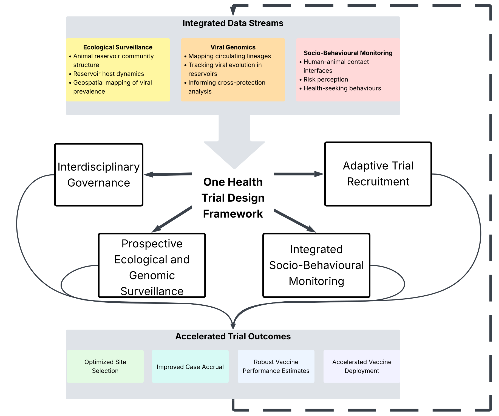

This commentary, forthcoming in *Nature Medicine*, argues for a new ‘One Health Trial Design’ (OHTD) framework that systematically integrates ecological and social science data into the vaccine research and development pipeline. Using the current effort to develop a Lassa fever vaccine as a critical test case, we propose a path to accelerate the delivery of effective vaccines and provide a blueprint for future pandemic preparedness.

***

## Summary

The development of vaccines for zoonotic diseases like Lassa fever is hampered by unpredictable spillover events, making clinical trial design particularly challenging. Overcoming these challenges requires adopting a ‘One Health vaccinology’ approach that weaves together human, animal, and environmental health. Our proposed OHTD framework systematically integrates ecological and social data into three critical areas of vaccine development: (1) incorporating viral diversity into vaccine design, (2) assisting in strategic site selection for clinical trials, and (3) evaluating vaccine performance across trial and real-world settings. By creating interdisciplinary governance and using prospective surveillance and adaptive recruitment, the OHTD can lead to more targeted, dynamic, and efficient trials that focus resources where spillover risk is highest.

***

## Publication Details

* **Journal:** *Nature Medicine* (In Press)
* **Link:** A link will be added upon publication.

## Authors

David Simons, Deborah Watson-Jones, Daniela Manno, and Sagan Friant.
