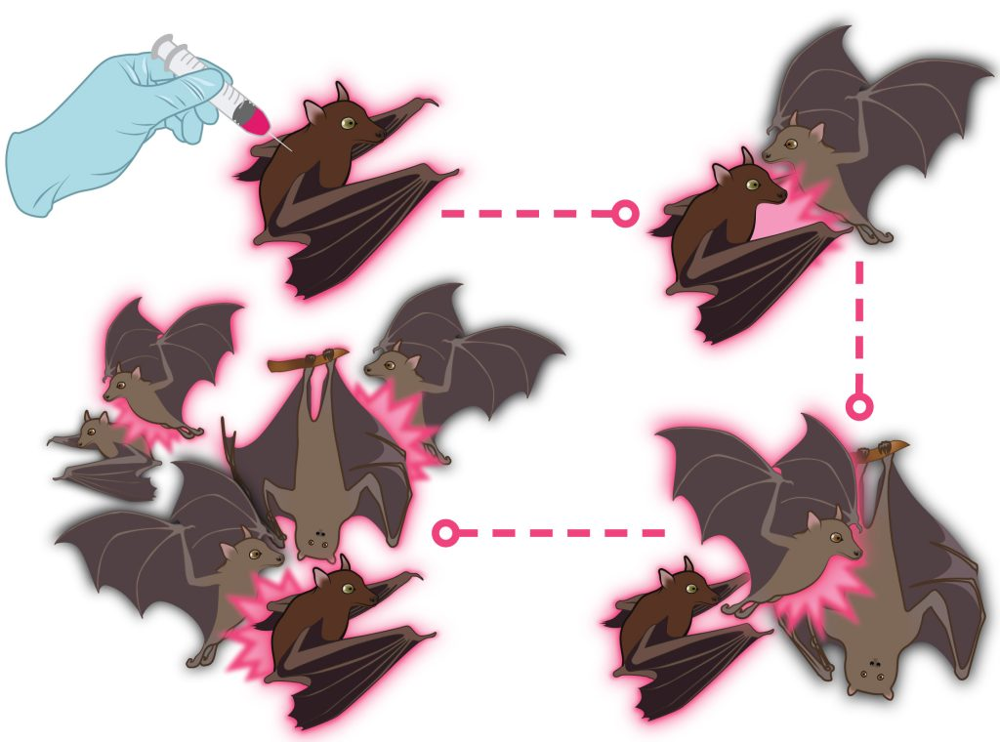

This publication in *Science* was the primary output of an interdisciplinary workshop I attended in March 2023, which was organized by [Prof. Scott Nuismer](https://www.leeef.org/) and [Prof. Daniel Streicker](https://streickerlab.com/). The workshop convened researchers and practitioners to coordinate the development of [self-disseminating vaccines](https://transmissiblevaccines.org/) for preventing pathogen spillover from wildlife.

The resulting manuscript outlines a series of commitments and strategies to ensure the potential benefits of this technology in conservation and zoonosis prevention outweigh the inherent risks.

## Publication Details

* **Journal:** *Science*
* **Full Citation:** Streicker, D. G., Simons, D., et al. (2024). "Developing transmissible vaccines for animal infections." *Science*, 384(6693), 275-277.
* **Links:** The article is available from the [publisher's website](https://www.science.org/stoken/author-tokens/ST-1824/full) and the [University of Glasgow repository](https://eprints.gla.ac.uk/323783/).

