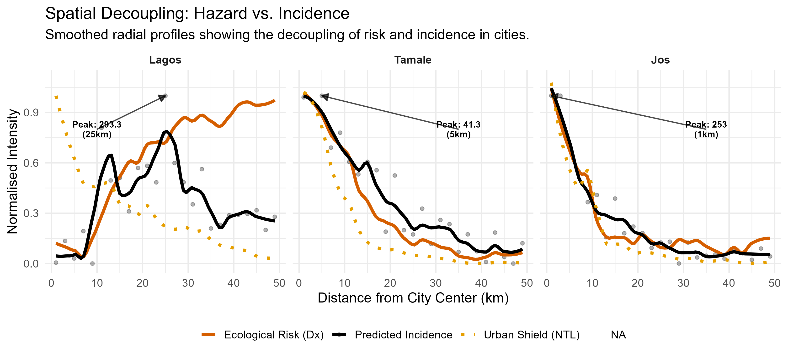
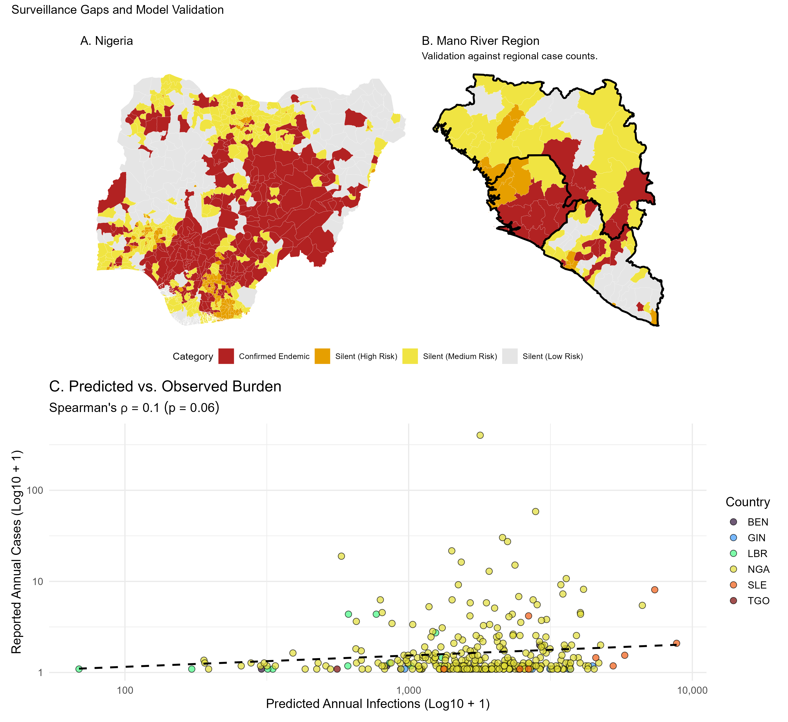

Spatial risk models for Lassa fever have mostly described the reservoir, *Mastomys natalensis*, with climatic envelopes, and so predict a rural disease. West African cities are growing fast, and urban land use changes which rodents live where. This work assesses what happens to the predicted risk when the reservoir's interactions with other rodents and with human infrastructure are modelled directly.

:::: {.stat-row}
::: {.stat}
[2.6 million]{.stat-num}
[estimated Lassa virus infections a year across the endemic region]{.stat-label}
:::
::: {.stat}
[3]{.stat-num}
[countries with silent districts: Nigeria, Benin and Togo]{.stat-label}
:::
::::

## Approach

An integrated multi-species occupancy model estimates the realised niche of *M. natalensis* together with two invasive commensals, *Rattus rattus* and *Mus musculus*, so that co-occurrence is part of the model rather than ignored. Spillover to people is then modelled with a socio-economic shield, proxied by night-time lights, which dampens transmission non-linearly as urban infrastructure increases.

## Findings

- **The reservoir reaches the urban fringe.** With species interactions in the model, *M. natalensis* is estimated to persist in peri-urban and human-modified landscapes, not to be excluded by the invasive commensals.
- **Hazard and incidence separate across a city.** Ecological hazard stays high towards the urban core, but predicted incidence peaks at the periphery, where the shield is weaker.
- **About 2.6 million infections a year.** Adjusting for seroreversion and shielding gives an estimated regional burden near 2.6 million Lassa virus infections a year.
- **Silent districts.** Validation against clinical data identifies districts in Nigeria, Benin and Togo with high predicted incidence and no reported cases. These are more plausibly surveillance gaps than places without hazard.

{fig-alt="Radial profiles from West African city centres: ecological hazard stays high while predicted incidence peaks at the periphery."}

{fig-alt="Maps of districts with high predicted Lassa virus infections and no reported cases, with predicted against reported cases by district."}

The work points to the peri-urban interface as a priority for active surveillance, and it is a starting point for wider work on rodent-borne zoonoses in growing cities. See also [Lassa epidemiology](/research/lassa-epidemiology.html) and [rodent-borne disease ecology](/research/rodent-disease-ecology.html).

**Code:** [GitHub](https://github.com/DidDrog11/lassa-bridging-reanalysis)

## Paper

```{r}
#| results: asis
#| echo: false
#| message: false
#| warning: false
# Papers assigned to this page in data/publications_overrides.csv.
source(here::here("scripts", "paper_cards.R"))
render_programme_papers("research/lassa-cities.qmd")
```
