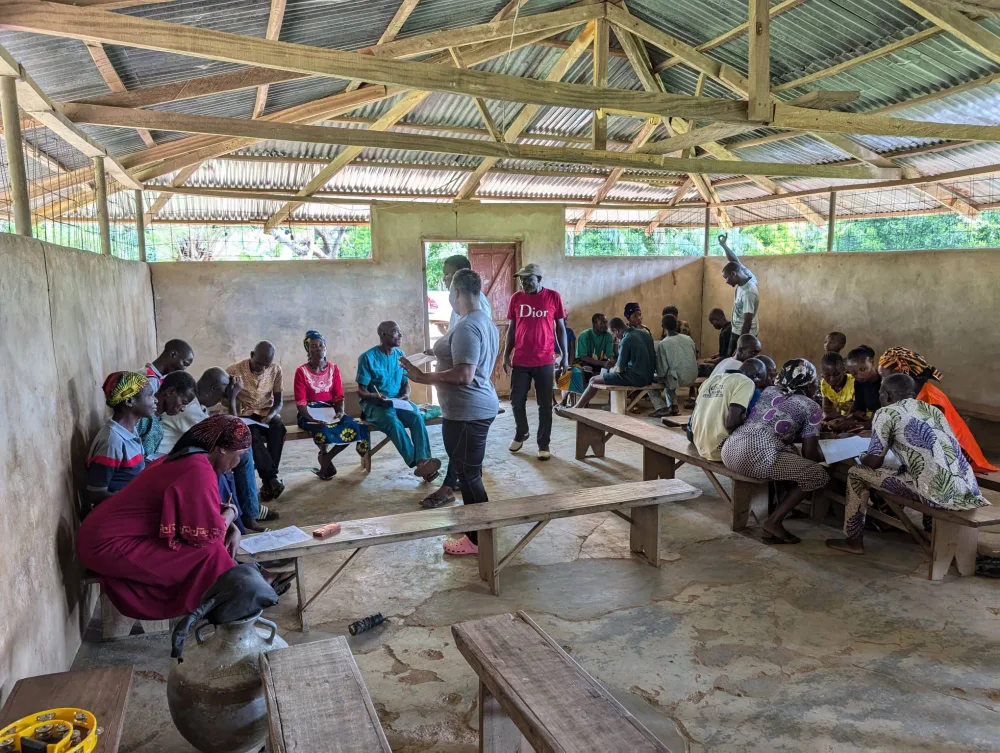

SCAPES (Scaling Lassa Virus Dynamics within Anthropogenic Ecosystems) asks how people's land use and movement shape their contact with the rodent reservoir of *Mammarenavirus lassaense*, and how that contact scales up to spillover across a landscape. It follows people, rodents and land cover together in nine villages in Benue, Ebonyi and Cross River states, Nigeria, with fieldwork since late 2023.

The study is a five-year [NSF Ecology and Evolution of Infectious Diseases grant](https://www.nsf.gov/awardsearch/showAward?AWD_ID=2208034), led by [Sagan Friant](https://www.saganfriant.com/) at Pennsylvania State University with [Lina Moses](https://sph.tulane.edu/ihsd/lina-moses), [David Redding](https://www.zsl.org/about-zsl/our-people/dr-david-redding) and partners in Nigeria. I am a collaborator on the project, working on the human and rodent ecology that moderates the risk of infection.

{fig-alt="Community members seated on benches in a village hall, working through paper forms with members of the study team." width="80%"}

:::: {.stat-row}
::: {.stat}
[9]{.stat-num}
[villages in Benue, Ebonyi and Cross River states]{.stat-label}
:::
::: {.stat}
[1,874]{.stat-num}
[people tested for Lassa virus antibodies]{.stat-label}
:::
::: {.stat}
[1,200+]{.stat-num}
[rodents and shrews sampled]{.stat-label}
:::
::::

## Progress

| Workstream | Status |
| --- | --- |
| Study protocol | Published, *Wellcome Open Research* |
| Site selection | Published as SiteTool, *Ecography* |
| Participatory rural appraisal | Published, *EcoHealth* |
| Baseline human serosurvey | Published, *PLOS Neglected Tropical Diseases* |
| Human movement (GPS tracking and activity diaries) | Data collection complete; paper in preparation |
| Rodent sampling | More than 1,200 rodents and shrews sampled; laboratory analysis ongoing |
| Land cover from drone imagery | Classification in preparation |

Later stages link rodent abundance, human movement and seroconversion in an interface model, test it in independent villages, and design interventions with the communities.

## Findings so far

- **Exposure is local.** Among 1,874 people tested, Lassa virus seroprevalence was 3.2% overall but ranged from under 1% to over 6% between neighbouring villages, and none of 21 candidate risk factors showed a strong or consistent association. Trial site selection needs active serosurveillance, not regional incidence maps. [Paper](#pub-10_1371_journal_pntd_0014379).
- **Contact follows land use.** Communities reported more *Mastomys* activity after land clearing and the rice harvest, more movement between fields and homes where houses are interspersed with farmland, and contact that differs with gendered agricultural work. [Paper](#pub-10_1007_s10393_026_01810_9).

## Data and code

- **Project hub.** The [SCAPES repository](https://github.com/RiskLabPSU/SCAPES_Project) indexes the project's public code, data releases and protocols. Identifiable human data, including GPS tracks and household locations, are held privately under the study's ethical approvals.
- **Baseline serosurvey.** Code on [GitHub](https://github.com/RiskLabPSU/baseline-seroprev-public); aggregated data on [Zenodo](https://doi.org/10.5281/zenodo.19677372).
- **SiteTool.** The [Shiny application](https://github.com/BioDivHealth/sitetool) used to select the field sites.
- **Project website.** Field sites and collaborators are on the [SCAPES story map](https://storymaps.arcgis.com/templates/751190c765ee441c9589d65ac34fe9d0).

Preliminary serology and the project's aims were presented at the Second Lassa Fever International Conference, Abidjan, 2025. [Poster](../lassa/files/scapes/scapes_poster_1.pdf).

## Papers

```{r}
#| results: asis
#| echo: false
#| message: false
#| warning: false
# Papers assigned to this page in data/publications_overrides.csv.
source(here::here("scripts", "paper_cards.R"))
render_programme_papers("research/scapes.qmd")
```
