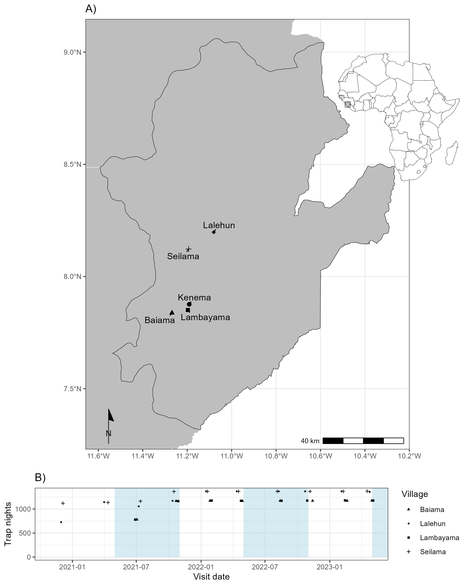
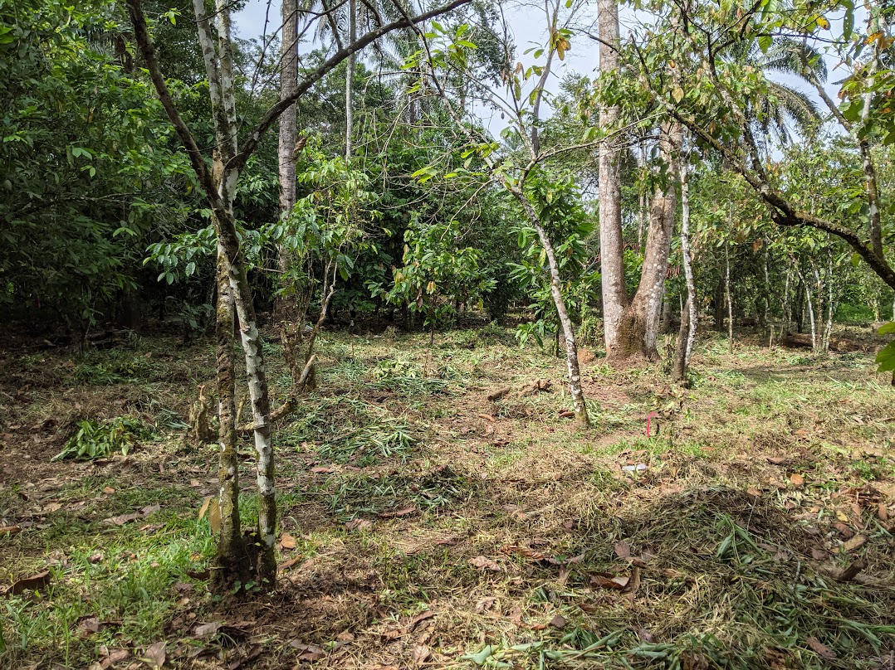
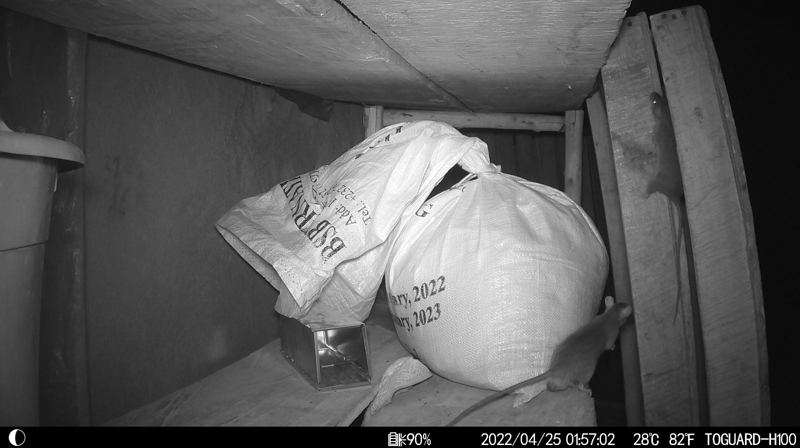

My doctoral fieldwork trapped small mammals at four villages around Kenema, in the Eastern Province of Sierra Leone, from 2020 to 2023. At each village, trapping ran along a land-use gradient from forest through agriculture into houses. Over 43,226 trap nights, the study asked how land use structures small-mammal communities, and what that structure means for *Mammarenavirus lassaense* in its reservoir, *Mastomys natalensis*.

The work was a collaboration between the Royal Veterinary College, University College London, the London School of Hygiene and Tropical Medicine, Njala University, Kenema Government Hospital and the Bernhard Nocht Institute for Tropical Medicine.

## Study design

{fig-alt="Map of Eastern Province, Sierra Leone, showing Baiama, Lalehun, Lambayama and Seilama near Kenema, above a plot of trap nights per visit from late 2020 to mid 2023." width="70%"}

The protocol was registered on the [Open Science Framework](https://osf.io/usjrd/) before the pilot session in November 2020. Field data were collected with [Open Data Kit](https://getodk.org/). Lambayama, on the edge of Kenema, gives a peri-urban comparison with the three rural villages.

{fig-alt="Tree-crop land with cleared undergrowth and a marker flag, where traps were set." width="70%"}

## Findings

- **Land use and the reservoir.** Occupancy of *Mastomys natalensis* rose along the gradient from forest through agriculture to villages. It was lower in the peri-urban village than in rural ones. In the peri-urban village, the presence of the invasive *Mus musculus* was associated with reduced occupancy. [Paper](#pub-10_1111_1365_2656_70187).
- **Contact networks.** Contact networks reconstructed from co-trapping were larger in villages and agriculture than in forest. Antibodies to *Mammarenavirus lassaense* were found in nine rodent and shrew species, at an overall seroprevalence of 5.7%, so surveillance restricted to *M. natalensis* would miss species that may contribute to local circulation. [Paper](#pub-10_4269_ajtmh_25_0120). The [bank vole project at Uppsala](/research/bank-voles.html) continues this work, using gut microbiome similarity to trace contact in wild rodent populations.
- **Trapping studies as data.** A review of 127 rodent trapping studies across West Africa found trapping effort biased towards densely populated areas. Trapping records add the non-detections that range maps and occurrence databases lack. [Paper](#pub-10_1371_journal_pntd_0010772). [Project ArHa](/research/arha.html) extends this synthesis worldwide, for arenaviruses and hantaviruses.

## Inside houses

Camera traps set alongside the trapping, with [Najmul Haider](https://scholar.google.com/citations?user=Iv4wObEAAAAJ), recorded rodents inside houses.

{fig-alt="Camera-trap image of a rodent next to food storage inside a house." width="70%"}

## Papers

```{r}
#| results: asis
#| echo: false
#| message: false
#| warning: false
# Papers assigned to this page in data/publications_overrides.csv.
source(here::here("scripts", "paper_cards.R"))
render_programme_papers("research/sierra-leone.qmd")
```

## Data and code

- **Land use and host communities.** Code and data on [GitHub](https://github.com/DidDrog11/land-use-lassa-hosts), archived on [PHAROS](https://pharos.viralemergence.org/projects/?prj=prjyg91YQvrdk).
- **Contact networks.** Code and data on [GitHub](https://github.com/DidDrog11/rodent-networks-lassa-sl).
- **Review of rodent trapping studies.** The dataset is on [Zenodo](https://doi.org/10.5281/zenodo.7022637), the code on [GitHub](https://github.com/DidDrog11/scoping_review), and an [app](https://diddrog11.shinyapps.io/scoping_review_app/) explores the records.

## Talks

- **Ecology and Evolution of Infectious Diseases, 2022.** Results from the first year of trapping. [Watch the talk](https://www.youtube.com/watch?v=vxQLYwDRvK8) or read the [slides](../lassa/files/david_simons_EEID.pdf).
- **American Society of Tropical Medicine and Hygiene, Chicago, 2023.** Contact networks. [Slides](../lassa/files/rodent_network/ASTMH_presentation.pdf).
- **Second Lassa Fever International Conference, Abidjan, 2025.** Contact networks. [Slides](../lassa/files/rodent_network/oral_presentation_2.pdf).
- **Ecology and Evolution of Infectious Diseases, 2021.** The review of rodent trapping studies. [Poster](../lassa/files/EEID_poster.pdf).
