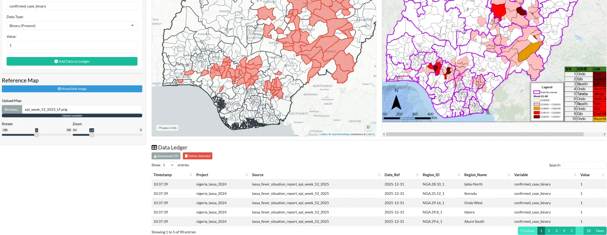
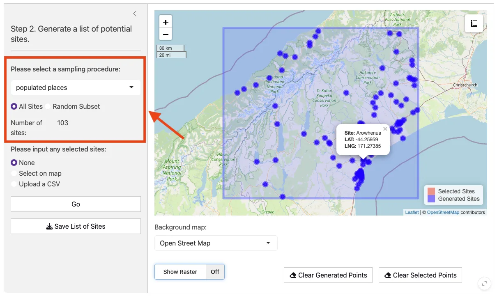
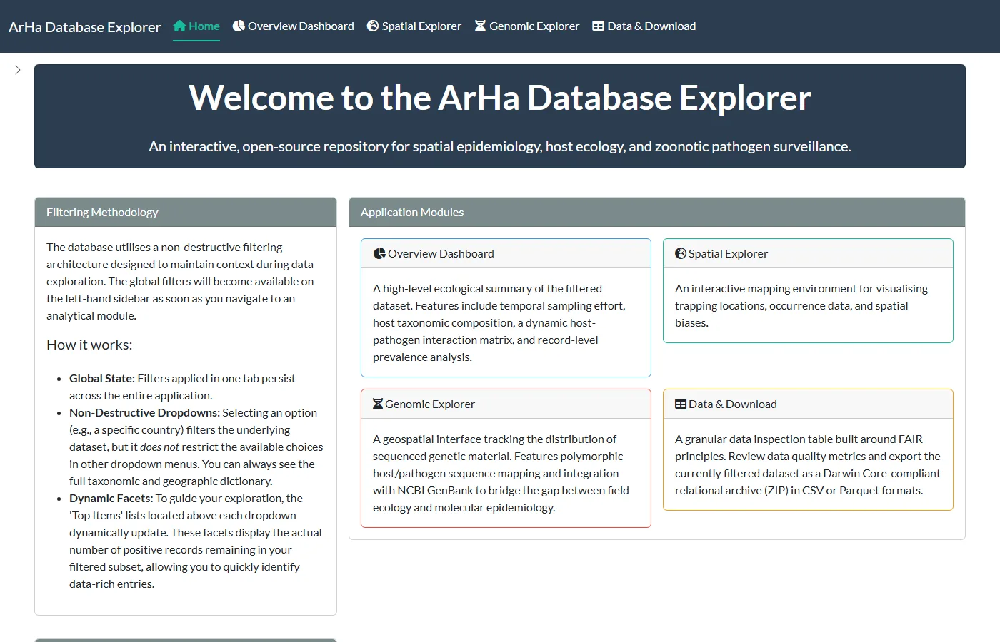

A surprising amount of what field epidemiology needs is locked in a PDF, chosen by convenience, or never recorded at all. These tools and standards each fix one instance of that. All are open source.

## Applications

The applications run on a free hosting tier and go to sleep when unused, so the first load can take up to a minute. Each one's source is on GitHub if the hosted version is unavailable.

::: {.app-grid}

::: {.app-card}
{fig-alt="Map Liberator: an interactive map of Nigerian local government areas with selected areas shaded, beside the source situation report map and a data ledger table."}

### Map Liberator

Recovers sub-national data from static maps, such as those in PDF situation reports, by assigning values to official administrative boundaries and exporting a table ready for analysis.

[Launch the app](https://diddrog11.shinyapps.io/map-liberator/){.btn .btn-primary .btn-sm}

[Code](https://github.com/DidDrog11/map-liberator) · [Archive](https://doi.org/10.5281/zenodo.18325137) · [Preprint](#pub-10_64898_2026_01_26_26344575)
:::

::: {.app-card}
{fig-alt="SiteTool: candidate field sites generated from populated places, plotted as points on a map within a study area."}

### SiteTool

Generates candidate field sites within a study area and tests a chosen set for environmental bias before fieldwork begins. It structured the sampling frame for SCAPES in Nigeria.

[Launch the app](https://ecosyshealth.shinyapps.io/SiteTool/){.btn .btn-primary .btn-sm}

[Code](https://github.com/BioDivHealth/sitetool) · [Paper](#pub-10_1002_ecog_08455)
:::

::: {.app-card}
{fig-alt="ArHa Database Explorer home page, listing its overview, spatial, genomic and data download modules."}

### ArHa Database Explorer

Filters, maps and downloads the Project ArHa records of small mammals sampled for arenaviruses and hantaviruses, including linked sequences, in Darwin Core format.

[Launch the app](https://diddrog11.shinyapps.io/ArHa_Database_Explorer/){.btn .btn-primary .btn-sm}

[Code](https://github.com/DidDrog11/arenavirus_hantavirus) · [Data](https://doi.org/10.5281/zenodo.21978982) · [Project](/research/arha.html)
:::

:::

## Data standard

A minimum data standard for wildlife disease research and surveillance, from the Verena consortium, sets out 31 essential fields so that records from different studies can be combined. It records negative results to the same standard as positive ones, so that absence of a pathogen can be told apart from absence of sampling. It underpins the [PHAROS](https://pharos.viralemergence.org/) database.

## Data deposits

- **Project ArHa.** Global records of small mammals sampled for arenaviruses and hantaviruses, on [Zenodo](https://doi.org/10.5281/zenodo.21978982).
- **Sierra Leone trapping study.** Individual-level records of small mammals trapped and tested, on [PHAROS](https://pharos.viralemergence.org/projects/?prj=prjyg91YQvrdk).
- **Rodent trapping studies in West Africa.** The dataset from the review, on [Zenodo](https://doi.org/10.5281/zenodo.7022637), with an [app](https://diddrog11.shinyapps.io/scoping_review_app/) to explore it.
- **SCAPES baseline serosurvey.** Aggregated data on [Zenodo](https://doi.org/10.5281/zenodo.19677372).
- **Lassa virus host and case data.** The tables on the Lassa epidemiology page, as [hosts](/data/lassa_hosts.csv) and [cases](/data/lassa_cases.csv) (CSV).

## Papers

```{r}
#| results: asis
#| echo: false
#| message: false
#| warning: false
# Papers assigned to this page in data/publications_overrides.csv.
source(here::here("scripts", "paper_cards.R"))
render_programme_papers("research/tools.qmd")
```
